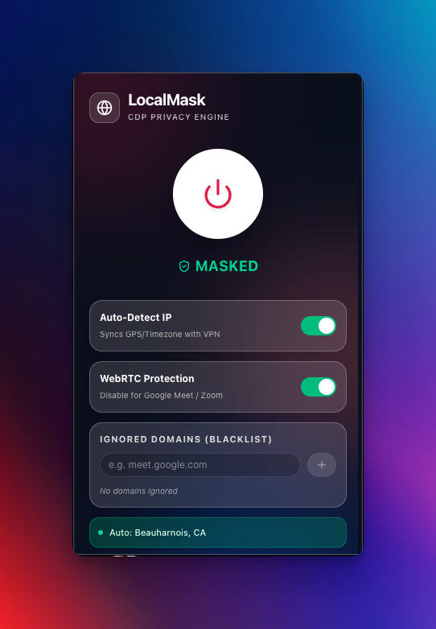
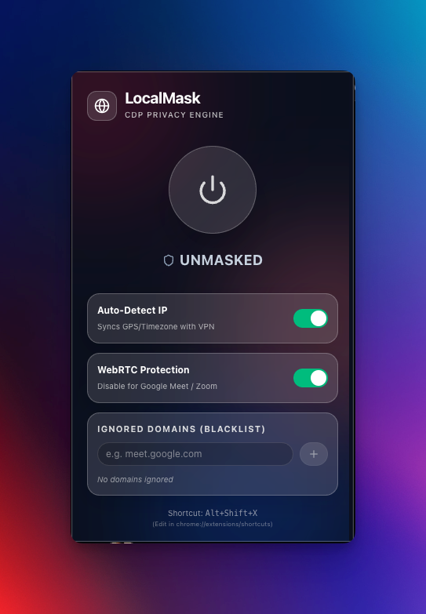

<p align="center">
  
</p>

<h1 align="center">LocalMask</h1>

<p align="center">
  <strong>Next-Generation Chrome DevTools Protocol (CDP) Privacy Engine</strong><br>
  <em>Bypass strict browser fingerprinting with zero JavaScript injection.</em>
</p>

<p align="center">
  <a href="https://github.com/ChosoMeister/LocalMask/blob/main/LICENSE">
    
  </a>
  <a href="#">
    
  </a>
  <a href="#">
    
  </a>
</p>

<p align="center">
  <a href="#english">English</a> &nbsp; &middot; &nbsp; <a href="#persian">فارسی (Persian)</a>
</p>

<hr>

<h2 id="english">🇬🇧 English Documentation</h2>

LocalMask represents a paradigm shift in browser privacy tools. Traditional spoofing extensions rely on injecting JavaScript into the page (e.g., overriding `Date.prototype` or `Intl.DateTimeFormat`). Modern anti-bot and fingerprinting scripts (like CreepJS, Pixelscan, and BrowserLeaks) can instantly detect these JavaScript proxies and flag your session.

**LocalMask uses a completely different approach.** By hooking directly into the Chrome DevTools Protocol (CDP) via the `chrome.debugger` API, it alters the V8 engine parameters natively. The spoofed data (Timezone, Geolocation, Language) appears indistinguishable from a legitimate, un-tampered browser.

### 🛡️ Core Capabilities

- **Zero-Footprint Spoofing:** Absolute native emulation. No script tags are injected, making it invisible to standard anti-fingerprinting scripts.
- **Dynamic IP Synchronization:** If enabled, the extension queries `ipwho.is` to automatically map your browser's internal GPS coordinates and Timezone strictly to your current VPN/Proxy node.
- **Selective Domain Exclusion (Blacklist):** Need to join a Google Meet call without routing your WebRTC through the proxy? Add `meet.google.com` to the ignored list, and LocalMask will step aside entirely for that domain. You can also use wildcards like `*.axon.me` to ignore all subdomains, or even `*.ir` to exclude entire TLDs!
- **WebRTC Shield:** Aggressively drops non-proxied UDP connections via the `chrome.privacy` API, neutralizing WebRTC IP leaks.
- **Hotkeys:** Instantly toggle your privacy state globally by pressing `Alt+Shift+X` (or `Option+Shift+X`).

### 📸 Interface

<p align="center">
  
  &nbsp;&nbsp;&nbsp;&nbsp;
  
</p>

### 🧪 Testing & Verification

To understand the power of LocalMask, we highly recommend testing your browser's fingerprint before and after turning on the extension. By default, standard VPNs change your IP, but they leave your browser's internal Timezone, Geolocation, and WebRTC exposed. LocalMask patches these leaks natively.

**Recommended Test Sites:**
- [WebBrowserTools Timezone](https://webbrowsertools.com/timezone/) - Check if your JavaScript `Intl` and `Date` objects match your VPN's Timezone.
- [BrowserLeaks WebRTC](https://browserleaks.com/webrtc) - Verify that your real local/public IP is not leaking through WebRTC UDP channels.
- [DNSLeakTest](https://dnsleaktest.com/) - Ensure your DNS requests are routed properly.
- [Whoer.net](https://whoer.net) / [Pixelscan](https://pixelscan.net) - General anonymity and bot-detection scanners.
- [CreepJS](https://abrahamjuliot.github.io/creepjs/) - The ultimate fingerprinting test. Notice how LocalMask avoids the "lies" and "tampering" flags that other spoofers trigger because it operates on the CDP level rather than JS injection.

### 🙈 Suppressing the "Started Debugging" Infobar

LocalMask's privacy engine uses the Chrome DevTools Protocol (`chrome.debugger` API) to inspect and modify browser traffic natively. Whenever *any* extension uses this API, Chromium-based browsers (Chrome, Edge, Brave, etc.) display a persistent infobar:

> *"LocalMask - CDP Privacy Engine" started debugging this browser*

This is an intentional, hardcoded security UX feature in Chromium—there is no in-app setting to turn it off. It does not affect functionality, and you can safely ignore or cancel it without interrupting LocalMask. However, if you want to hide it entirely during local development, follow the guides below.

#### 🪟 Windows (Recommended)
1. Right-click your Chrome or Edge shortcut and select **Properties**.
2. Add `--silent-debugger-extension-api` to the end of the **Target** field (make sure there is a space before it).
3. Restart the browser using this newly modified shortcut.

#### 🍏 macOS (Option 1: Automator App - Recommended)
Since double-clicking a macOS Dock icon doesn't allow passing command-line flags, you can wrap the launch command in a simple Automator app:

1. Open **Automator** → **New Document** → **Application**.
2. Add a **Run Shell Script** action with the following code (adjust for Chrome if needed):
   ```bash
   open -a "Microsoft Edge" --args --silent-debugger-extension-api
   ```
3. Save it as `Edge (Debug-Silent).app` in your Applications folder.
4. *(Optional)* Give it the real browser icon: `Right Click` -> `Get Info` on the real browser app → click its icon in the top left → `Cmd+C` → `Get Info` on your new Automator app → click its icon → `Cmd+V`.
5. Pin this new app to your Dock and use it to launch the browser.

#### 🍏 macOS (Option 2: Enterprise Policy)
Alternatively, Chromium exposes a managed policy `SilentDebuggerExtensionAPIEnabled`. 
You can try applying this via terminal, though modern macOS often requires a `.mobileconfig` profile and a full system restart for it to be fully recognized by `chrome://policy`.

```bash
# For Google Chrome
defaults write com.google.Chrome SilentDebuggerExtensionAPIEnabled -bool true

# For Microsoft Edge
defaults write com.microsoft.edgemac SilentDebuggerExtensionAPIEnabled -bool true
```
*Note: If `defaults write` does not work, stick to Option 1.*

### 📦 Setup Guide

1. Clone the repository:
   ```bash
   git clone https://github.com/ChosoMeister/LocalMask.git
   cd LocalMask
   ```
2. Install dependencies and compile the production build:
   ```bash
   npm install
   npm run build
   ```
3. Load it into Chrome:
   - Navigate to `chrome://extensions/`
   - Toggle **Developer mode** ON
   - Click **Load unpacked** and select the generated `dist` folder.

---

<h2 id="persian">🇮🇷 مستندات فارسی (Persian)</h2>

پروژه LocalMask یک تحول اساسی در ابزارهای حفظ حریم خصوصی مرورگرهاست. افزونه‌های سنتی برای تغییر لوکیشن، کدهای جاوا اسکریپت را به صفحه تزریق می‌کنند (مثلاً `Date.prototype` را بازنویسی می‌کنند). سیستم‌های مدرن تشخیص ربات و انگشت‌نگاری مرورگر (مانند CreepJS، Pixelscan و BrowserLeaks) می‌توانند این تغییرات جاوا اسکریپتی را در کسری از ثانیه شناسایی کنند.

**رویکرد LocalMask کاملاً متفاوت است.** این ابزار با استفاده از پروتکل قدرتمند دیباگر کروم (CDP) و API رسمی `chrome.debugger`، پارامترهای موتور V8 مرورگر را به صورت کاملاً ذاتی (Native) تغییر می‌دهد. در این حالت، دیتای تغییر یافته (تایم‌زون، موقعیت جغرافیایی، زبان) دقیقاً مشابه یک مرورگر دست‌نخورده و طبیعی به نظر می‌رسد.

### 🛡️ قابلیت‌های کلیدی

- **تغییر بدون ردپا (Zero-Footprint):** هیچ کد جاوا اسکریپتی به صفحات وب تزریق نمی‌شود، بنابراین برای اسکریپت‌های ضد-انگشت‌نگاری کاملاً نامرئی است.
- **همگام‌سازی داینامیک IP:** افزونه می‌تواند مختصات دقیق جغرافیایی و تایم‌زون VPN یا پراکسی فعلی شما را از `ipwho.is` دریافت کرده و روی مرورگر اعمال کند.
- **استثنا کردن دامنه‌ها (لیست سیاه):** آیا نیاز دارید وارد جلسه Google Meet شوید اما نمی‌خواهید سرعتتان به خاطر پراکسی افت کند؟ کافیست `meet.google.com` را به لیست سیاه اضافه کنید تا افزونه روی آن سایت غیرفعال بماند. همچنین می‌توانید از وایلدکارت (Wildcard) استفاده کنید؛ مثلاً با اضافه کردن `*.axon.me` تمامی ساب‌دامین‌های این سایت مستثنی می‌شوند، یا حتی با اضافه کردن `*.ir` می‌توانید کل دامنه‌های ایرانی را از پراکسی خارج کنید!
- **سپر WebRTC:** با اعمال سیاست‌های سخت‌گیرانه روی `chrome.privacy`، از نشت آی‌پی واقعی شما جلوگیری می‌کند.
- **کلیدهای میانبر (Hotkeys):** با فشردن `Alt+Shift+X` (یا `Option+Shift+X`) در هر کجای سیستم، افزونه را به سرعت خاموش یا روشن کنید.

### 📸 رابط کاربری (UI)

<p align="center">
  
  &nbsp;&nbsp;&nbsp;&nbsp;
  
</p>

### 🧪 تست و اعتبارسنجی

برای درک بهتر قدرت LocalMask، پیشنهاد می‌کنیم قبل و بعد از روشن کردن افزونه، وضعیت مرورگر خود را تست کنید. 
وی‌پی‌ان‌های (VPN) معمولی فقط آی‌پی شما را تغییر می‌دهند، اما ساعت سیستم (Timezone)، لوکیشن GPS و WebRTC شما دست‌نخورده باقی می‌ماند و سایت‌ها به راحتی متوجه هویت واقعی شما می‌شوند. LocalMask تمام این حفره‌ها را به صورت ریشه‌ای می‌پوشاند.

**سایت‌های پیشنهادی برای تست:**
- [تست Timezone](https://webbrowsertools.com/timezone/) - بررسی کنید که آیا ساعت مرورگر شما دقیقاً با ساعت سرور VPN یکی شده است یا خیر.
- [تست نشت WebRTC](https://browserleaks.com/webrtc) - مطمئن شوید که آی‌پی واقعی یا لوکال شما از طریق کانال‌های WebRTC لو نمی‌رود.
- [DNSLeakTest](https://dnsleaktest.com/) - برای اطمینان از عدم نشت درخواست‌های DNS.
- [Whoer.net](https://whoer.net) / [Pixelscan](https://pixelscan.net) - سایت‌های جامع برای تست میزان ناشناس بودن و تشخیص ربات.
- [CreepJS](https://abrahamjuliot.github.io/creepjs/) - یکی از سخت‌گیرانه‌ترین سایت‌های انگشت‌نگاری. تست کنید و ببینید که به خاطر استفاده از پروتکل CDP، این افزونه برخلاف سایر ابزارها هیچ خطای "دستکاری کد (Tampering)" یا "دروغ (Lies)" ایجاد نمی‌کند!

### 🙈 مخفی کردن نوار هشدار دیباگر

موتور حریم خصوصی LocalMask برای دستکاری امن ترافیک مرورگر، از پروتکل DevTools کروم (`chrome.debugger` API) استفاده می‌کند. هر زمان که *هر افزونه‌ای* از این قابلیت استفاده کند، مرورگرهای بر پایه کرومیوم (مثل کروم، اج، بریو و غیره) یک نوار هشدار دائمی نمایش می‌دهند:

> *"LocalMask - CDP Privacy Engine" started debugging this browser*

این یک ویژگی امنیتی از پیش‌تعریف‌شده در هسته کرومیوم است و هیچ تنظیماتی در خود مرورگر برای خاموش کردن آن وجود ندارد. این نوار هیچ تاثیری در عملکرد افزونه ندارد و می‌توانید با خیال راحت آن را نادیده بگیرید یا ضربدر آن را بزنید. اما اگر می‌خواهید برای همیشه از شر آن خلاص شوید، از روش‌های زیر استفاده کنید:

#### 🪟 در ویندوز (Windows)
۱. روی شورت‌کات کروم یا اج در دسکتاپ کلیک راست کرده و **Properties** را بزنید.
۲. در انتهای کادر **Target** یک فاصله (Space) بدهید و عبارت `--silent-debugger-extension-api` را اضافه کنید.
۳. مرورگر را کاملاً ببندید و از طریق همین شورت‌کات باز کنید.

#### 🍏 در مک (macOS - روش پیشنهادی با Automator)
از آنجا که در مک نمی‌توان روی آیکون‌های پین‌شده در Dock آرگومان ست کرد، بهترین راه ساخت یک برنامه راه‌انداز است:

۱. برنامه **Automator** را باز کنید → **New Document** → سپس **Application** را انتخاب کنید.
۲. اکشن **Run Shell Script** را به صفحه اضافه کرده و کد زیر را در آن قرار دهید (در صورت نیاز نام مرورگر را تغییر دهید):
   ```bash
   open -a "Microsoft Edge" --args --silent-debugger-extension-api
   ```
۳. آن را با نامی مثل `Edge Secure.app` در پوشه Applications ذخیره کنید.
۴. *(اختیاری)* برای تغییر آیکون: روی برنامه اصلی اج Get Info بگیرید → روی عکس آیکون بالا سمت چپ کلیک کنید → `Cmd+C` → حالا روی برنامه جدید Automator همینطور Get Info بگیرید → روی عکس کلیک کنید و `Cmd+V` را بزنید.
۵. این برنامه جدید را در داک پین کنید و همیشه از طریق آن وارد مرورگر شوید.

#### 🍏 در مک (macOS - روش جایگزین با Policy)
یک راه دیگر استفاده از پالیسی‌های سازمانی کروم است. می‌توانید دستور زیر را در ترمینال وارد کنید، اگرچه در نسخه‌های جدید macOS این روش گاهی به پروفایل نصب `.mobileconfig` و ری‌استارت کامل سیستم نیاز دارد تا توسط `chrome://policy` شناسایی شود.

```bash
# برای گوگل کروم (Google Chrome)
defaults write com.google.Chrome SilentDebuggerExtensionAPIEnabled -bool true

# برای مایکروسافت اج (Microsoft Edge)
defaults write com.microsoft.edgemac SilentDebuggerExtensionAPIEnabled -bool true
```
*نکته: اگر روش ترمینال جواب نداد، از همان روش پیشنهادی اول (Automator) استفاده کنید.*

### 📦 راهنمای نصب و راه‌اندازی

۱. مخزن را کلون کنید:
   ```bash
   git clone https://github.com/ChosoMeister/LocalMask.git
   cd LocalMask
   ```
۲. وابستگی‌ها را نصب کرده و نسخه نهایی را بیلد بگیرید:
   ```bash
   npm install
   npm run build
   ```
۳. نصب در مرورگر کروم:
   - به آدرس `chrome://extensions/` بروید.
   - گزینه **Developer mode** را روشن کنید.
   - روی **Load unpacked** کلیک کنید و پوشه `dist` تولید شده در پروژه را انتخاب نمایید.

---

<p align="center">
  Developed by <strong>ChosoMeister</strong>
</p>
