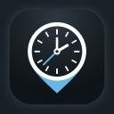

<p align="center">
  
</p>

<h1 align="center">LocalMask</h1>

<p align="center">
  <strong>Next-Generation Chrome DevTools Protocol (CDP) Privacy Engine</strong><br>
  <em>Bypass strict browser fingerprinting with zero JavaScript injection.</em>
</p>

<p align="center">
  <a href="https://github.com/ChosoMeister/LocalMask/blob/main/LICENSE">
    
  </a>
  <a href="#">
    
  </a>
  <a href="#">
    
  </a>
</p>

<p align="center">
  <a href="#english">English</a> &nbsp; &middot; &nbsp; <a href="#persian">فارسی (Persian)</a>
</p>

<hr>

<h2 id="english">🇬🇧 English Documentation</h2>

LocalMask represents a paradigm shift in browser privacy tools. Traditional spoofing extensions rely on injecting JavaScript into the page (e.g., overriding `Date.prototype` or `Intl.DateTimeFormat`). Modern anti-bot and fingerprinting scripts (like CreepJS, Pixelscan, and BrowserLeaks) can instantly detect these JavaScript proxies and flag your session.

**LocalMask uses a completely different approach.** By hooking directly into the Chrome DevTools Protocol (CDP) via the `chrome.debugger` API, it alters the V8 engine parameters natively. The spoofed data (Timezone, Geolocation, Language) appears indistinguishable from a legitimate, un-tampered browser.

### 🛡️ Core Capabilities

- **Zero-Footprint Spoofing:** Absolute native emulation. No script tags are injected, making it invisible to standard anti-fingerprinting scripts.
- **Dynamic IP Synchronization:** If enabled, the extension queries `ipwho.is` to automatically map your browser's internal GPS coordinates and Timezone strictly to your current VPN/Proxy node.
- **Selective Domain Exclusion (Blacklist):** Need to join a Google Meet call without routing your WebRTC through the proxy? Add `meet.google.com` to the ignored list, and LocalMask will step aside entirely for that domain.
- **WebRTC Shield:** Aggressively drops non-proxied UDP connections via the `chrome.privacy` API, neutralizing WebRTC IP leaks.
- **Hotkeys:** Instantly toggle your privacy state globally by pressing `Alt+Shift+X` (or `Option+Shift+X`).

### 🧪 Testing & Verification

To understand the power of LocalMask, we highly recommend testing your browser's fingerprint before and after turning on the extension. By default, standard VPNs change your IP, but they leave your browser's internal Timezone, Geolocation, and WebRTC exposed. LocalMask patches these leaks natively.

**Recommended Test Sites:**
- [WebBrowserTools Timezone](https://webbrowsertools.com/timezone/) - Check if your JavaScript `Intl` and `Date` objects match your VPN's Timezone.
- [BrowserLeaks WebRTC](https://browserleaks.com/webrtc) - Verify that your real local/public IP is not leaking through WebRTC UDP channels.
- [DNSLeakTest](https://dnsleaktest.com/) - Ensure your DNS requests are routed properly.
- [Whoer.net](https://whoer.net) / [Pixelscan](https://pixelscan.net) - General anonymity and bot-detection scanners.
- [CreepJS](https://abrahamjuliot.github.io/creepjs/) - The ultimate fingerprinting test. Notice how LocalMask avoids the "lies" and "tampering" flags that other spoofers trigger because it operates on the CDP level rather than JS injection.

### 🙈 Hide "Started Debugging" Infobar

Chrome displays a security infobar when the debugger API is active. To hide it permanently on your local machine:

**Windows:**
1. Right-click your Chrome/Edge shortcut and select **Properties**.
2. Add `--silent-debugger-extension-api` to the end of the **Target** field (with a space before it).
3. Restart the browser using this shortcut.

**macOS:**
Run this command in Terminal to set the enterprise policy, then completely Quit (Cmd+Q) and reopen the browser:
```bash
# For Google Chrome
defaults write com.google.Chrome SilentDebuggerExtensionAPIEnabled -bool true

# For Microsoft Edge
defaults write com.microsoft.edgemac SilentDebuggerExtensionAPIEnabled -bool true
```

### 📦 Setup Guide

1. Clone the repository:
   ```bash
   git clone https://github.com/ChosoMeister/LocalMask.git
   cd LocalMask
   ```
2. Install dependencies and compile the production build:
   ```bash
   npm install
   npm run build
   ```
3. Load it into Chrome:
   - Navigate to `chrome://extensions/`
   - Toggle **Developer mode** ON
   - Click **Load unpacked** and select the generated `dist` folder.

---

<h2 id="persian">🇮🇷 مستندات فارسی (Persian)</h2>

پروژه LocalMask یک تحول اساسی در ابزارهای حفظ حریم خصوصی مرورگرهاست. افزونه‌های سنتی برای تغییر لوکیشن، کدهای جاوا اسکریپت را به صفحه تزریق می‌کنند (مثلاً `Date.prototype` را بازنویسی می‌کنند). سیستم‌های مدرن تشخیص ربات و انگشت‌نگاری مرورگر (مانند CreepJS، Pixelscan و BrowserLeaks) می‌توانند این تغییرات جاوا اسکریپتی را در کسری از ثانیه شناسایی کنند.

**رویکرد LocalMask کاملاً متفاوت است.** این ابزار با استفاده از پروتکل قدرتمند دیباگر کروم (CDP) و API رسمی `chrome.debugger`، پارامترهای موتور V8 مرورگر را به صورت کاملاً ذاتی (Native) تغییر می‌دهد. در این حالت، دیتای تغییر یافته (تایم‌زون، موقعیت جغرافیایی، زبان) دقیقاً مشابه یک مرورگر دست‌نخورده و طبیعی به نظر می‌رسد.

### 🛡️ قابلیت‌های کلیدی

- **تغییر بدون ردپا (Zero-Footprint):** هیچ کد جاوا اسکریپتی به صفحات وب تزریق نمی‌شود، بنابراین برای اسکریپت‌های ضد-انگشت‌نگاری کاملاً نامرئی است.
- **همگام‌سازی داینامیک IP:** افزونه می‌تواند مختصات دقیق جغرافیایی و تایم‌زون VPN یا پراکسی فعلی شما را از `ipwho.is` دریافت کرده و روی مرورگر اعمال کند.
- **استثنا کردن دامنه‌ها (لیست سیاه):** آیا نیاز دارید وارد جلسه Google Meet شوید اما نمی‌خواهید سرعتتان به خاطر پراکسی افت کند؟ کافیست `meet.google.com` را به لیست سیاه اضافه کنید تا افزونه روی آن سایت غیرفعال بماند.
- **سپر WebRTC:** با اعمال سیاست‌های سخت‌گیرانه روی `chrome.privacy`، از نشت آی‌پی واقعی شما جلوگیری می‌کند.
- **کلیدهای میانبر (Hotkeys):** با فشردن `Alt+Shift+X` (یا `Option+Shift+X`) در هر کجای سیستم، افزونه را به سرعت خاموش یا روشن کنید.

### 🧪 تست و اعتبارسنجی

برای درک بهتر قدرت LocalMask، پیشنهاد می‌کنیم قبل و بعد از روشن کردن افزونه، وضعیت مرورگر خود را تست کنید. 
وی‌پی‌ان‌های (VPN) معمولی فقط آی‌پی شما را تغییر می‌دهند، اما ساعت سیستم (Timezone)، لوکیشن GPS و WebRTC شما دست‌نخورده باقی می‌ماند و سایت‌ها به راحتی متوجه هویت واقعی شما می‌شوند. LocalMask تمام این حفره‌ها را به صورت ریشه‌ای می‌پوشاند.

**سایت‌های پیشنهادی برای تست:**
- [تست Timezone](https://webbrowsertools.com/timezone/) - بررسی کنید که آیا ساعت مرورگر شما دقیقاً با ساعت سرور VPN یکی شده است یا خیر.
- [تست نشت WebRTC](https://browserleaks.com/webrtc) - مطمئن شوید که آی‌پی واقعی یا لوکال شما از طریق کانال‌های WebRTC لو نمی‌رود.
- [DNSLeakTest](https://dnsleaktest.com/) - برای اطمینان از عدم نشت درخواست‌های DNS.
- [Whoer.net](https://whoer.net) / [Pixelscan](https://pixelscan.net) - سایت‌های جامع برای تست میزان ناشناس بودن و تشخیص ربات.
- [CreepJS](https://abrahamjuliot.github.io/creepjs/) - یکی از سخت‌گیرانه‌ترین سایت‌های انگشت‌نگاری. تست کنید و ببینید که به خاطر استفاده از پروتکل CDP، این افزونه برخلاف سایر ابزارها هیچ خطای "دستکاری کد (Tampering)" یا "دروغ (Lies)" ایجاد نمی‌کند!

### 🙈 مخفی کردن نوار هشدار دیباگر

مرورگر کروم به دلیل استفاده افزونه از API دیباگر، یک نوار هشدار امنیتی نمایش می‌دهد. برای مخفی کردن دائمی آن در سیستم خود:

**در ویندوز (Windows):**
۱. روی شورت‌کات کروم یا اج کلیک راست کرده و **Properties** را بزنید.
۲. در انتهای کادر **Target** یک فاصله (Space) بدهید و عبارت `--silent-debugger-extension-api` را اضافه کنید.
۳. مرورگر را ببندید و از طریق همین شورت‌کات باز کنید.

**در مک (macOS):**
برنامه Terminal را باز کرده و دستور مربوطه را اجرا کنید. سپس مرورگر را کاملاً ببندید (Cmd+Q) و مجدداً باز کنید:
```bash
# برای گوگل کروم (Google Chrome)
defaults write com.google.Chrome SilentDebuggerExtensionAPIEnabled -bool true

# برای مایکروسافت اج (Microsoft Edge)
defaults write com.microsoft.edgemac SilentDebuggerExtensionAPIEnabled -bool true
```

### 📦 راهنمای نصب و راه‌اندازی

۱. مخزن را کلون کنید:
   ```bash
   git clone https://github.com/ChosoMeister/LocalMask.git
   cd LocalMask
   ```
۲. وابستگی‌ها را نصب کرده و نسخه نهایی را بیلد بگیرید:
   ```bash
   npm install
   npm run build
   ```
۳. نصب در مرورگر کروم:
   - به آدرس `chrome://extensions/` بروید.
   - گزینه **Developer mode** را روشن کنید.
   - روی **Load unpacked** کلیک کنید و پوشه `dist` تولید شده در پروژه را انتخاب نمایید.

---

<p align="center">
  Developed by <strong>ChosoMeister</strong>
</p>
